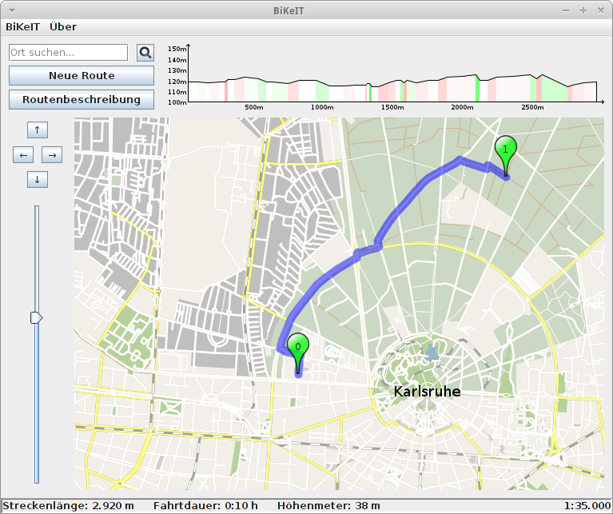
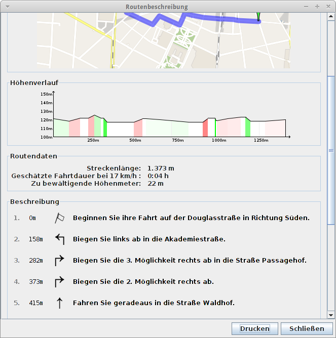

**BiKeIT** ist eine Anwendung zum Planen einer Fahrradroute, die aus der Lehrveranstaltung [Praxis der Softwareentwicklung](http://pp.info.uni-karlsruhe.de/lehre/WS201112/pse/) am [Karsruher Institut für Technologie](http://www.kit.edu/) hervorging, und privat als Open-Source-Projekt fortgeführt wird.

Ziel war es, aus den Rohdaten der Umgebung Karlsruhe eine ansehnliche Karte zu rendern und dabei eine möglichst performante Berechnung einer Route von Start- zu Zielpunkt zu ermöglichen. Die Anwendung greift hierzu unter anderem auf die umfangreichen Kartendaten des [OpenStreetMap](http://openstreetmap.org/)-Projekts zurück.

Anders als bekannte Kartendienste, bezieht **BiKeIT** keine fertig gerenderten Kartenelemente und benötigt somit keine aktive Internetverbindung.

---
### Download

**BiKeIT** ist zur Zeit für die Region Karlsruhe-Heidelberg-Straßburg verfügbar. 

* [BiKeIT für Windows](https://www.dropbox.com/s/2ytr4xf0mbnlfsn/BiKeIT-0.9.0.exe?dl=0)
* [BiKeIT für Linux (Debian-Paket)](https://www.dropbox.com/s/r08u7kdf9a947y5/bikeit_0.9.0-1_all.deb?dl=0)
* [BiKeIT für alle Plattformen](https://www.dropbox.com/s/7kif3mkjnm7xh11/BiKeIT-0.9.0.jar?dl=0)

Sie benötigen die [Java-Laufzeitumgebung](http://www.java.com/de/download/).

**Hinweis:**
Wenn Sie *BiKeIT für alle Plattformen* gewählt haben, verwenden Sie bitte den Aufruf<code><pre>java -Xmx2g -jar BiKeIT.jar</pre></code>um eine performante Ausführung zu garantieren.

---
### Screenshots

---
### Entwicklung

Das Projekt wurde nach dem klassischen Wasserfallmodell entwickelt. Hieraus entstanden einige Dokumente, die wir Ihnen nicht vorenthalten wollen. Alle Dokumente stehen unter der Creative Commons Lizenz [BY-ND-NC](https://creativecommons.org/licenses/by-nc-nd/3.0/de/).

* [Pflichtenheft](doc/documents/BiKeIT-Pflichtenheft.pdf)
* [Entwurf](doc/documents/BiKeIT-Entwurf.pdf)
* [Implementierungsbericht](doc/documents/BiKeIT-Implementierungsbericht.pdf)
* [Validierung](doc/documents/BiKeIT-Validierung.pdf)
* [Klassendiagramm des Anwendungsprogramms](doc/diagrams/Klassendiagramm-Anwendungsprogramm.pdf)
* [Klassendiagramm des Vorberechners](doc/diagrams/Klassendiagramm-Vorberechnung.pdf)

Quellcode sowie Vorberechnungsprogramm:

* [Quellcode](app/BiKeIT-0.9.0-src.tar.gz)
* [Vorberechnungsprogramm](app/Vorberechner.jar)

BiKeIT ist ein Open-Source-Projekt, lizenziert unter der [GPLv3](https://www.gnu.org/licenses/gpl-3.0.html).

**Lizenz**:

BiKeIT - ein Routenplaner für Fahrradfahrer
Copyright (C) 2011-2012 Sven Esser, Manuel Fink, Thomas Keh, Tilman Väth, Lukas Vojković, Fabian Winnen

This program is free software: you can redistribute it and/or modify it under the terms of the GNU General Public License as published by the Free Software Foundation, version 3 of the License.

This program is distributed in the hope that it will be useful, but WITHOUT ANY WARRANTY; without even the implied warranty of MERCHANTABILITY or FITNESS FOR A PARTICULAR PURPOSE. See the GNU General Public License for more details.

You should have received a copy of the GNU General Public License along with this program. If not, see [here](https://www.gnu.org/licenses/gpl-3.0.html).

---
### Impressum

**Entwickler:**  

* Sven Esser
* Manuel Fink
* Thomas Keh
* Tilman Väth
* Lukas Vojković
* Fabian Winnen

**Kontakt:**  
developer.bikeit@gmail.com

**Kartendaten:**  
Die Kartenrohdaten stammen vom [OpenStreetMap](http://openstreetmap.org/)-Projekt.

**Höhendaten**:  
Die Höhendaten entstammen der [Shuttle Radar Topography Mission (SRTM)](http://www.ecogis.de/srtm.html).

**BiKeIT steht in keinem offiziellen Verhältnis zum Karlsruher Institut für Technologie!**

---
&copy;2011-2012 Sven Esser, Manuel Fink, Thomas Keh, Tilman Väth, Lukas Vojković, Fabian Winnen 